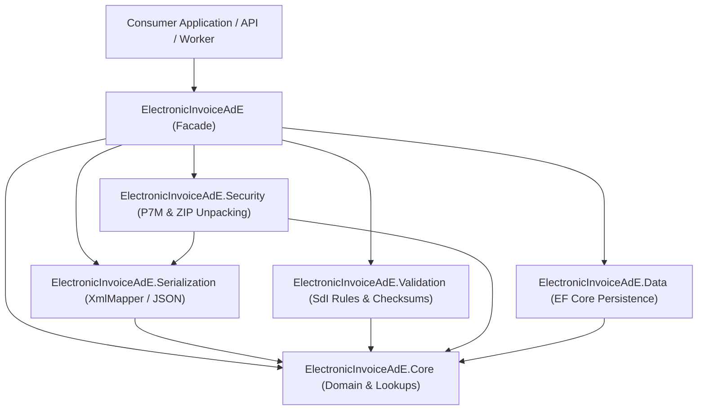

# ElectronicInvoiceAdE
[](https://www.nuget.org/packages/ElectronicInvoiceAdE/)
[](https://dotnet.microsoft.com/)
[](https://learn.microsoft.com/dotnet/csharp/)
[](LICENSE)
[](https://www.agenziaentrate.gov.it/)
[](tests)
[](docs/ai-usage-disclosure.md)

**ElectronicInvoiceAdE** is a modern, high-performance, standalone .NET library and domain engine for Italian Electronic Invoicing (**Fatturazione Elettronica**) conforming to the official technical specifications of the **Agenzia delle Entrate** and the **Sistema di Interscambio (SdI)**.

Designed for modern enterprise backends, cloud microservices, and standalone accounting systems, it multi-targets **.NET 8.0, .NET 9.0, and .NET 10.0** with **C# 13**, zero circular dependencies, resilient reflection-based XML mapping, transparent `.p7m` digital signature unpacking, multi-invoice ZIP extraction, and an offline fiscal validation engine.

---

## Supported Formats & Specifications

- **Ordinary Invoices (`FatturaElettronica`)**:
  - `FPR12`: B2B (Business-to-Business) and B2C (Business-to-Consumer) transactions between private entities.
  - `FPA12`: B2G (Business-to-Government) transactions with Italian Public Administrations.
- **Simplified Invoices (`FatturaElettronicaSemplificata`)**:
  - `FSM10`: Simplified electronic invoices (amounts up to €400,00 or rectification notes).
- **Envelopes & Archives**:
  - **CAdES-BES PKCS#7 (`.xml.p7m` / `.p7m`)**: Raw binary DER and Base64 PEM signed containers.
  - **Batch ZIP Archives (`.zip`)**: Extraction and parsing of compressed mixed invoice packages.
- **Official Specification Baseline**: Agenzia delle Entrate Technical Specifications **v1.9.1**.

---

## Key Features

- **Idiomatic Strongly Typed Domain Models**: Clear, English-named domain models (`OrdinaryInvoice`, `SimplifiedInvoice`, `Supplier`, `Customer`, `InvoiceBody`, `InvoiceLineItem`, `VatSummary`) mapped precisely to Italian XML tags (`CedentePrestatore`, `CessionarioCommittente`, `DatiBeniServizi`, `DatiRiepilogo`).
- **Exhaustive Fiscal Lookup Catalogs**: Strongly typed constants and validation helpers for `DocumentType` (TD01–TD29), `TaxRegime` (RF01–RF20), `VatNature` (N1–N7), `PaymentMethod` (MP01–MP23), `PensionFundType` (TC01–TC22), and `WithholdingType` (RT01–RT06).
- **Resilient XML Mapping**: Custom `XmlMapper` tolerant to arbitrary XML namespaces (`p:`, `b:`, default), missing nodes, formatting variations, and self-closing tags.
- **Legacy Encoding Support**: Automatic registration of `CodePagesEncodingProvider` to seamlessly parse invoices encoded in `windows-1252` and `ISO-8859-1` generated by legacy ERPs.
- **CAdES-BES Unpacking & Certificate Inspection**: Transparently inspects and unwraps `.p7m` signatures, exposing signer certificates, issuer, thumbprint, validity dates, and timestamps.
- **Offline Fiscal & Mathematical Validator**: Pure C# validation algorithms for Italian **Partita IVA** (11-digit modified Luhn) and **Codice Fiscale** (16-character alphanumeric odd/even character weight tables and omocodia resolution), alongside official SdI business rules (e.g., VAT group rule `00327`, 0% VAT nature checks `00400`/`00401`).
- **Round-Trip Serialization**: Fast serialization to compliant indented XML or structured JSON.
- **Entity Framework Core Integration**: Pre-configured relational database persistence module (`ElectronicInvoiceAdE.Data`) supporting custom entity extensions and querying.

---

## Quick Start

### 1. Installation

Reference the metapackage or individual modules depending on your project needs:

```shell
dotnet add package ElectronicInvoiceAdE
```

Or reference specific submodules:
- `ElectronicInvoiceAdE.Core`: Domain models and lookup catalogs.
- `ElectronicInvoiceAdE.Serialization`: XML and JSON serializers.
- `ElectronicInvoiceAdE.Validation`: Fiscal checksums and SdI rules.
- `ElectronicInvoiceAdE.Security`: P7M envelope unpacking and ZIP reading.
- `ElectronicInvoiceAdE.Data`: Entity Framework Core relational mappings.

---

### 2. Loading Invoices (XML, .p7m, or .zip)

The high-level facade `ElectronicInvoiceDocument` transparently detects the underlying format, encoding, and signature envelope:

```csharp
using ElectronicInvoiceAdE;
using ElectronicInvoiceAdE.Ordinary;
using ElectronicInvoiceAdE.Simplified;

// Load transparently from a plain XML or a signed .xml.p7m file
object doc = ElectronicInvoiceDocument.Load("IT01234567890_00001.xml.p7m");

if (doc is OrdinaryInvoice ordinary)
{
    Console.WriteLine($"Invoice Number: {ordinary.PrimaryBody.GeneralData.DocumentGeneralData.Number}");
    Console.WriteLine($"Document Date:  {ordinary.PrimaryBody.GeneralData.DocumentGeneralData.Date:yyyy-MM-dd}");
    Console.WriteLine($"Supplier Name:  {ordinary.Header.Supplier.Identification.LegalName.CompanyName}");
    Console.WriteLine($"Supplier P.IVA: {ordinary.Header.Supplier.Identification.TaxId.Code}");
    Console.WriteLine($"Customer Name:  {ordinary.Header.Customer.Identification.LegalName?.CompanyName}");

    foreach (var line in ordinary.PrimaryBody.GoodsAndServices.Lines)
    {
        Console.WriteLine($"  - Line {line.LineNumber}: {line.Description} (Qty: {line.Quantity}, Total: {line.TotalPrice:C})");
    }
}
else if (doc is SimplifiedInvoice simplified)
{
    Console.WriteLine($"Simplified Invoice Number: {simplified.PrimaryBody.GeneralData.DocumentGeneralData.Number}");
}
```

#### Batch Reading from ZIP Archives

```csharp
// Unpack and parse all invoices in a ZIP package
List<ZipInvoiceEntry> batch = ElectronicInvoiceDocument.LoadFromZip("invoice_batch.zip");

foreach (var entry in batch)
{
    Console.WriteLine($"Extracted: {entry.EntryName} | Signed P7M: {entry.WasSigned}");
    if (entry.Invoice is OrdinaryInvoice invoice)
    {
        Console.WriteLine($"  Invoice Number: {invoice.PrimaryBody.GeneralData.DocumentGeneralData.Number}");
    }
}
```

---

### 3. Validating Invoices Against SdI Rules

Run offline checks against official Agenzia delle Entrate rules and Italian tax algorithms before transmission:

```csharp
using ElectronicInvoiceAdE.Extensions;

// Execute offline validation
var result = ordinary.Validate();

if (!result.IsValid)
{
    Console.WriteLine("Invoice has validation errors:");
    foreach (var error in result.Errors)
    {
        Console.WriteLine($"  [SdI {error.Code}] {error.Message} (Field: {error.PropertyName})");
    }
}

// Inspect warnings (e.g., non-blocking check-digit alerts)
foreach (var warning in result.Warnings)
{
    Console.WriteLine($"  [Warning {warning.Code}] {warning.Message}");
}
```

---

### 4. Serializing to XML & JSON

```csharp
using ElectronicInvoiceAdE.Extensions;

// Export to compliant, formatted XML string
string xml = ordinary.ToXml(indented: true);

// Save directly to disk
ordinary.Save("IT01234567890_00001.xml", indented: true);

// Convert to JSON for REST APIs or messaging queues
string json = ordinary.ToJson(indented: true);
```

---

## Solution Architecture

The solution adheres to clean architecture principles with strict modular boundaries and zero circular references:



| Module | Assembly | Responsibility |
| :--- | :--- | :--- |
| **Facade** | `ElectronicInvoiceAdE` | Unified entry points (`ElectronicInvoiceDocument`), fluent extension methods (`InvoiceExtensions`). |
| **Core** | `ElectronicInvoiceAdE.Core` | `OrdinaryInvoice`, `SimplifiedInvoice`, and typed lookups (`DocumentType`, `TaxRegime`, `VatNature`, etc.). |
| **Serialization** | `ElectronicInvoiceAdE.Serialization` | Resilient `XmlMapper`, `InvoiceReader`, `InvoiceWriter`, and `JsonSerialization`. |
| **Validation** | `ElectronicInvoiceAdE.Validation` | `InvoiceValidator` (SdI v1.9.1 rules), `ItalianTaxValidation` (Partita IVA Luhn & Codice Fiscale). |
| **Security** | `ElectronicInvoiceAdE.Security` | `SignedInvoiceReader` (CAdES-BES PKCS#7 extraction), `ZipInvoiceReader` (ZIP batch processing). |
| **Data** | `ElectronicInvoiceAdE.Data` | `ElectronicInvoiceDbContext`, flattened queryable relational entities, EF Core configurations. |

---

## Extensive Documentation

Explore the comprehensive guides located in the [`docs/`](docs/) directory:

- [**Documentation Index**](docs/README.md): Table of contents and role-based reading guides.
- [**Getting Started Guide**](docs/getting-started.md): Prerequisites, installation, and end-to-end tutorial.
- [**System Architecture**](docs/architecture.md): Modular design, memory efficiency, and pipeline mechanics.
- [**Domain Models & Lookups**](docs/domain-models-and-lookups.md): XML-to-C# mapping, Ordinary/Simplified models, and tax catalogs.
- [**Serialization & Encodings**](docs/serialization-and-encodings.md): Reflection XML parser, legacy codepages (`windows-1252`), and JSON round-trip.
- [**Security: P7M & ZIP Processing**](docs/security-p7m-and-zip.md): PKCS#7 CAdES-BES envelope handling, certificate metadata, and ZIP extraction.
- [**Validation & Fiscal Rules**](docs/validation-and-fiscal-rules.md): SdI business rules (00327, 00400, 00401) and Italian tax checksum algorithms.
- [**Database Persistence with EF Core**](docs/database-persistence-efcore.md): Relational schema, generic DbContext customization, and SQL indexing.
- [**Next Steps & Roadmap**](docs/next-steps-and-roadmap.md): Systematic feature gap analysis, SdI notifications engine, active digital signing, HTML/PDF viewer, and calculation engine.
- [**AI Usage Disclosure**](docs/ai-usage-disclosure.md): Transparent disclosure of artificial intelligence tools utilized during development and testing.

---

## AI Usage Disclosure

In adherence to transparency and open-source best practices, this repository openly discloses that generative artificial intelligence (specifically Google DeepMind Antigravity and Gemini models) was utilized as an engineering assistant during development. 

AI was used for domain scaffolding, cross-referencing ministerial XSD specifications, synthesizing comprehensive test cases (powering the 456 automated tests), and authoring technical documentation. All algorithmic logic, tax checksums, and cryptographic routines have undergone rigorous automated testing and human oversight. 

For the complete AI policy and technical governance details, read the [AI Usage Disclosure](docs/ai-usage-disclosure.md).

---

## Testing & Quality Assurance

The test suite contains **456 unit and integration tests** executing across **.NET 8.0, .NET 9.0, and .NET 10.0**:

```shell
dotnet test
```

Test projects include:
- `ElectronicInvoiceAdE.Core.Tests`: Fluent APIs, model defaults, and lookup correctness.
- `ElectronicInvoiceAdE.Serialization.Tests`: Real-world AdE sample parsing, prefix variations, and round-trips.
- `ElectronicInvoiceAdE.Validation.Tests`: SdI error codes, VAT group checks, Partita IVA Luhn, and Codice Fiscale checksums.
- `ElectronicInvoiceAdE.Security.Tests`: DER and Base64 CAdES-BES envelope unwrapping and certificate extraction.

---

## Contributing

Contributions, bug reports, and pull requests are welcome! Please check the [Next Steps & Roadmap](docs/next-steps-and-roadmap.md) to see prioritized backlog items.

1. Fork the repository.
2. Create your feature branch (`git checkout -b feature/amazing-feature`).
3. Ensure all tests pass (`dotnet test`) and code adheres to `<TreatWarningsAsErrors>true</TreatWarningsAsErrors>`.
4. Commit your changes (`git commit -m 'feat: add amazing feature'`).
5. Push to the branch (`git push origin feature/amazing-feature`).
6. Open a Pull Request.

---

## License

This project is licensed under the **MIT License** — see the [LICENSE](LICENSE) file for details.
