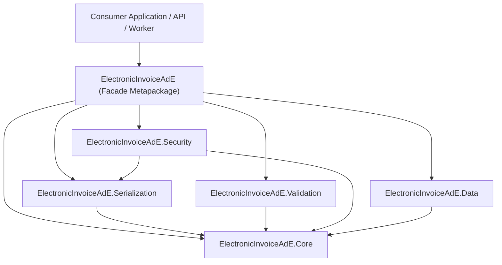
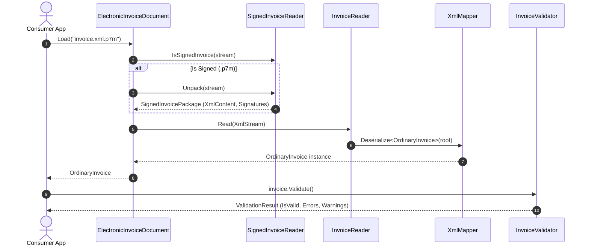

# System Architecture & Design Principles

**ElectronicInvoiceAdE** is designed as a modular, decoupled suite of .NET libraries built for high performance, zero circular dependencies, thread safety, and resilience against real-world invoice variations.

---

## 1. Architectural Overview

### Module Responsibilities

| Module | Purpose | Key Classes | Dependencies |
| :--- | :--- | :--- | :--- |
| **`ElectronicInvoiceAdE.Core`** | Pure domain models, value objects, and official fiscal lookup tables. Free of I/O, crypto, or database concerns. | `OrdinaryInvoice`, `SimplifiedInvoice`, `DocumentType`, `TaxRegime`, `VatNature`, `PaymentMethod` | None |
| **`ElectronicInvoiceAdE.Serialization`** | Bidirectional translation between domain models and XML/JSON representations. Enforces resilience to namespace prefixes and legacy encodings. | `XmlMapper`, `InvoiceReader`, `InvoiceWriter`, `JsonSerialization` | `Core`, `System.Text.Encoding.CodePages` |
| **`ElectronicInvoiceAdE.Validation`** | Pure algorithms for Italian tax codes and offline execution of official SdI business rules. | `InvoiceValidator`, `ItalianTaxValidation`, `ValidationError`, `ValidationResult` | `Core`, `FluentValidation` |
| **`ElectronicInvoiceAdE.Security`** | Unpacking CAdES-BES PKCS#7 digital signature containers and processing multi-invoice ZIP archives. | `SignedInvoiceReader`, `ZipInvoiceReader`, `SignedInvoicePackage`, `SignatureInfo` | `Core`, `Serialization`, `System.Security.Cryptography.Pkcs` |
| **`ElectronicInvoiceAdE.Data`** | Entity Framework Core relational mappings, flattened database entities, and DbContext for relational persistence. | `ElectronicInvoiceDbContext`, `InvoiceFileEntity`, `OrdinaryInvoiceEntity`, `InvoiceBodyEntity` | `Core`, `Microsoft.EntityFrameworkCore` |
| **`ElectronicInvoiceAdE`** | High-level facade metapackage providing transparent loading and fluent extension methods. | `ElectronicInvoiceDocument`, `InvoiceExtensions` | References all 5 submodules |

---

## 2. Core Architectural Principles

### 1. Separation of Concerns & Dependency Inversion
- **`Core` has zero external dependencies**: It contains plain C# POCO models annotated with XML attributes and static typed lookup classes.
- Consumers needing only domain models (e.g. client SDKs or blazor frontends) do not need to pull in Entity Framework Core or cryptographic packages.

### 2. High-Performance Reflection XML Mapping (`XmlMapper`)
Rather than relying on the standard, often rigid `System.Xml.Serialization.XmlSerializer`, the library utilizes a custom reflection-based `XmlMapper` designed around `System.Xml.Linq.XDocument`:
- **Prefix Agnostic**: XML files submitted to SdI often use prefixes like `p:FatturaElettronica`, `b:FatturaElettronica`, or no prefix at all. `XmlMapper` matches by local element name, ensuring consistent parsing regardless of namespace prefixing.
- **Null Safety & Resilience**: Empty elements (`<DatiAnagrafici/>`) and optional blocks are deserialized gracefully without throwing unhandled exceptions.
- **Attribute Matching**: Transparently handles both XML element tags (`[XmlElement]`) and XML attribute tags (`[XmlAttribute]`).

### 3. Legacy Encoding Resilience
Many ERP and billing systems emit XML files encoded in legacy single-byte encodings:
- By default, modern .NET supports only Unicode encodings (`UTF-8`, `UTF-16`, `UTF-32`).
- `ElectronicInvoiceAdE.Serialization` statically registers `System.Text.CodePagesEncodingProvider.Instance` upon first access, guaranteeing transparent loading of `windows-1252`, `ISO-8859-1`, and other legacy codepages.

### 4. Pure Mathematical & Offline Validation
- Validation is decoupled into two tiers:
  1. **Algorithmic check-digits**: Exact mathematical implementation of the Partita IVA modified Luhn algorithm and 16-character alphanumeric Codice Fiscale character weights.
  2. **SdI Business Rules**: Structural rules enforcing ministerial constraints (e.g., recipient code format, VAT group rules, 0% VAT nature checks).
- Validation runs purely in-memory with zero network or external database calls, making it ideal for high-throughput batch validation.

### 5. Cryptographic Envelope Unwrapping
- In Italian electronic invoicing, invoices sent to the Public Administration (`FPA12`) and many private invoices are signed with CAdES-BES (PKCS#7) producing `.xml.p7m` files.
- `ElectronicInvoiceAdE.Security` uses .NET's `System.Security.Cryptography.Pkcs.SignedCms` to unwrap the encapsulated XML content while extracting certificate metadata (Signer Subject, Issuer, Serial Number, Validity Dates, and Thumbprint).
- The reader automatically distinguishes raw binary DER signatures from Base64 PEM-wrapped containers (`-----BEGIN PKCS7-----`).

---

## 3. Data Flow Diagram

---

## 4. Multi-Targeting Strategy

The library targets:
- `.NET 8.0` (LTS)
- `.NET 9.0` (STS)
- `.NET 10.0` (Preview / Next-Gen)

Central Package Management (CPM) is configured via `Directory.Packages.props`, ensuring transitive dependencies and package versions are pinned predictably across all target frameworks.
Code quality is enforced project-wide with `<TreatWarningsAsErrors>true</TreatWarningsAsErrors>`.
