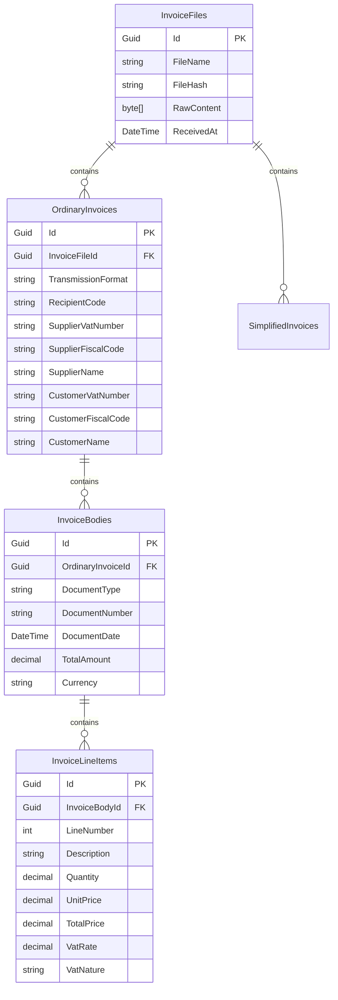

# Database Persistence with Entity Framework Core

The `ElectronicInvoiceAdE.Data` module provides relational database persistence for electronic invoices using **Entity Framework Core**. It maps complex nested invoice graphs into flattened, queryable tables optimized for SQL databases (PostgreSQL, SQL Server, SQLite, MySQL).

---

## 1. Schema Architecture



---

## 2. Setting Up `ElectronicInvoiceDbContext`

The library provides two ways to configure the database context:
1. **Convenience Context (`ElectronicInvoiceDbContext`)**: Pre-configured with the default entities.
2. **Generic Context (`ElectronicInvoiceDbContext<...>`)**: Allows consumer applications to subclass entities and add custom columns (e.g. `TenantId`, `AccountingStatus`, `JournalEntryId`).

### Registering in ASP.NET Core `Program.cs`

```csharp
using Microsoft.EntityFrameworkCore;
using ElectronicInvoiceAdE.Data;

var builder = WebApplication.CreateBuilder(args);

// Register DbContext with your preferred database provider
builder.Services.AddDbContext<ElectronicInvoiceDbContext>(options =>
    options.UseSqlServer(builder.Configuration.GetConnectionString("InvoicesDatabase")));
```

---

## 3. Querying Invoices with LINQ

Because properties like supplier VAT, customer name, document number, and emission date are indexed in dedicated columns, queries run at high speed without needing to parse the full XML:

```csharp
using Microsoft.EntityFrameworkCore;
using ElectronicInvoiceAdE.Data;
using ElectronicInvoiceAdE.Data.Entities;

public class InvoiceRepository
{
    private readonly ElectronicInvoiceDbContext _context;

    public InvoiceRepository(ElectronicInvoiceDbContext context)
    {
        _context = context;
    }

    public async Task<List<OrdinaryInvoiceEntity>> GetInvoicesBySupplierAsync(string vatNumber, int year)
    {
        return await _context.OrdinaryInvoices
            .Include(i => i.Bodies)
                .ThenInclude(b => b.LineItems)
            .Where(i => i.SupplierVatNumber == vatNumber)
            .Where(i => i.Bodies.Any(b => b.DocumentDate.Year == year))
            .OrderByDescending(i => i.Bodies.Max(b => b.DocumentDate))
            .ToListAsync();
    }

    public async Task<OrdinaryInvoiceEntity?> FindInvoiceByNumberAsync(string supplierVat, string invoiceNumber)
    {
        return await _context.OrdinaryInvoices
            .Include(i => i.Bodies)
            .FirstOrDefaultAsync(i => 
                i.SupplierVatNumber == supplierVat && 
                i.Bodies.Any(b => b.DocumentNumber == invoiceNumber));
    }
}
```

---

## 4. Customizing Entities (Generic DbContext)

If your enterprise application requires multi-tenancy or audit columns, derive from the base entity classes:

```csharp
public class CustomInvoiceFile : InvoiceFileEntity
{
    public Guid TenantId { get; set; }
    public string IngestionSource { get; set; } = string.Empty;
}

public class AppDbContext : ElectronicInvoiceDbContext<
    CustomInvoiceFile,
    OrdinaryInvoiceEntity,
    SimplifiedInvoiceEntity,
    InvoiceBodyEntity,
    InvoiceLineItemEntity>
{
    public AppDbContext(DbContextOptions<AppDbContext> options) : base(options) { }

    protected override void OnModelCreating(ModelBuilder modelBuilder)
    {
        base.OnModelCreating(modelBuilder);
        modelBuilder.Entity<CustomInvoiceFile>().HasIndex(f => f.TenantId);
    }
}
```
