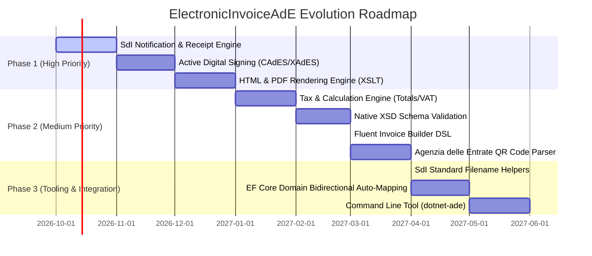

# Next Steps & Future Roadmap

This document outlines the architectural roadmap and planned feature enhancements for **ElectronicInvoiceAdE**. It categorizes upcoming milestones by priority, detailing technical requirements, design specifications, and impact on real-world electronic invoicing workflows.

---

## Roadmap Overview



---

## Phase 1: Production Completeness & Interoperability (High Priority)

### 1. SdI Notification & Receipt Engine (`MessaggiFatturaTypes`)
**Priority**: **Critical / High**  
**Resource in repo**: `documentation/1.9.1/ST Fatturazione elettronica - MessaggiFatturaTypes_MessaggiFatturaTypes_v1.0.xsd`

In production e-invoicing pipelines, managing incoming and outgoing invoices is only half the lifecycle. Systems must process asynchronous status notifications returned by SdI:

1. **RC (Ricevuta di Consegna)**: Proof of successful delivery to the recipient's telematics channel (contains transmission identifier, delivery date, and file hash).
2. **NS (Notifica di Scarto)**: Rejection notice returned when an invoice fails ministerial validation, containing `ListaErrori` with error codes and descriptions (within 5 days of submission).
3. **MC (Mancata Consegna)**: Notice indicating the invoice was accepted by SdI but could not be delivered to the recipient channel (e.g. recipient code `0000000` or channel offline). The invoice is made available in the customer's tax drawer (*Cassetto Fiscale*).
4. **MT (Metadati di Invio)**: Metadata file containing transmission ID, hash of transmitted file, recipient code, and delivery date.
5. **NE (Notifica di Esito Committente)**: Client outcome sent by Public Administration entities (`EC01` Acceptance, `EC02` Rejection with legal justification).
6. **DT (Decorrenza Termini)**: Term expiration notice emitted after 15 days if a Public Administration entity does not respond to an invoice.
7. **AT (Attestazione di Trasmissione)**: Attestation issued to the sender when delivery to a PA entity fails definitively, allowing certified delivery via alternative channels.

#### Proposed Architecture:
- Add a new project or namespace `ElectronicInvoiceAdE.Notifications`.
- Create typed models for all notification schemas (`DeliveryReceipt`, `RejectionNotice`, `MissedDeliveryNotice`, etc.).
- Implement `NotificationReader` and `NotificationWriter` integrating with `XmlMapper`.
- Extend `ElectronicInvoiceDocument.Load` to automatically recognize notification XML files.

---

### 2. Active Digital Signature Engine (CAdES-BES & XAdES-BES)
**Priority**: **High**  
**Impact**: Mandatory for all B2G / Public Administration invoices (`FPA12`) and cross-border transactions.

Currently, `ElectronicInvoiceAdE.Security` supports **unpacking** signed `.p7m` files (`SignedInvoiceReader`). A complete production suite must also support **generating** signed envelopes:

1. **CAdES-BES Signing (`.xml.p7m`)**:
   - Implement `SignedInvoiceWriter` / `InvoiceSigner`.
   - Accept an `X509Certificate2` (software certificate, PFX, smart card, USB token, or cloud HSM via Windows CAPI/CNG or PKCS#11).
   - Produce valid ASN.1 DER CMS signed envelopes enclosing the XML payload.
   - Embed mandatory signing time and certificate attributes.
2. **XAdES-BES Signing (Enveloped XMLDSIG)**:
   - Provide support for XMLDSIG signatures (`<ds:Signature>`) directly embedded in the XML document (allowed by SdI specifications as an alternative to `.p7m`).
3. **Cryptographic Verification**:
   - Validate certificate chain of trust against official Italian Agenzia per l'Italia Digitale (AgID) trusted list.
   - Check CRL (Certificate Revocation List) and OCSP endpoints for revoked certificates.

---

### 3. Human-Readable Rendering Engine (HTML & PDF Viewer)
**Priority**: **High**  
**Impact**: Crucial for accounting personnel, warehouse operators, and sending courtesy copies to B2C consumers.

Invoices stored as XML are difficult for humans to read and audit. The Agenzia delle Entrate and AssoSoftware publish standard XSLT stylesheets:
- `documentation/1.9.1/FatturaPA_v1.2.3.xsl`
- `documentation/1.9.1/FatturaSemplificata_v1.0.2.xsl`

#### Planned Capabilities:
- **HTML Transformation**: `invoice.ToHtml()` or `InvoiceRenderer.RenderHtml(invoice)` using compiled `XslCompiledTransform` with embedded official stylesheets.
- **PDF Generation**: Direct conversion of invoice data into printable/email-ready PDF courtesy copies (*Copia di Cortesia*), complete with page numbering, clear tabular layouts, and company headers.

---

## Phase 2: Business Logic & Developer Ergonomics (Medium Priority)

### 4. Calculation & Tax Engine
**Priority**: **Medium**  
**Impact**: Eliminates rounding discrepancies and manual VAT math when composing invoices.

Currently, numerical properties (`TotalPrice`, `TaxAmount`, `TaxableAmount`) are passive values. A dedicated calculation engine will automate:
1. **Line Total Calculation**:
   - Formula: `PrezzoTotale = (PrezzoUnitario * Quantita) - Sconti + Maggiorazioni`.
   - Respecting SdI rounding constraints: up to 8 decimal places for `UnitPrice`, rounded to 2 decimal places for `TotalPrice`.
2. **Automatic VAT Summaries Aggregation (`DatiRiepilogo`)**:
   - Grouping all invoice lines by `VatRate` and `VatNature`.
   - Summing taxable amounts and calculating tax amount (`Imposta = Round(Imponibile * Aliquota / 100)`).
3. **Withholding Tax (`DatiRitenuta`)**:
   - Calculating withholding deductions based on rate and payment causals (`RT01`, `RT02`).
4. **Professional Pension Funds (`DatiCassaPrevidenziale`)**:
   - Calculating contributions (e.g. 4% INPS or professional order pension funds) and determining whether the pension contribution is subject to VAT.
5. **Virtual Stamp Duty (`DatiBollo`)**:
   - Automatically applying €2,00 stamp duty when total exempt or non-taxable operations exceed €77,47.
6. **Split Payment (`ScissioneDeiPagamenti`)**:
   - Handling VAT collectibility `EsigibilitaIVA = S`, calculating the actual net payable amount by the PA customer.

---

### 5. Native Official XSD Schema Validation
**Priority**: **Medium**  
**Impact**: 100% pre-submission certainty against syntax violations.

While `InvoiceValidator` enforces semantic business rules, validating directly against official XSD files provides structural verification:
- Validate against `Schema_VFPR12.xsd` and `Schema_VFSM10.xsd` using `System.Xml.Schema.XmlSchemaSet`.
- Capture line and column numbers of any schema violation.
- Combine semantic validation and structural XSD validation into a single fluent call:
  ```csharp
  var result = invoice.ValidateWithSchema();
  ```

---

### 6. Fluent Invoice Builder DSL
**Priority**: **Medium**  
**Impact**: Drastically reduces boilerplate code when composing new invoices programmatically.

Composing an `OrdinaryInvoice` from scratch currently requires instantiating deep nested object graphs. A fluent builder simplifies invoice generation:

```csharp
OrdinaryInvoice invoice = InvoiceBuilder.CreateOrdinary()
    .WithTransmission(transmitterVat: "01234567890", recipientCode: "M5UXCR1")
    .WithSupplier(s => s
        .Named("Tech Innovations S.r.l.")
        .WithVat("IT01234567890")
        .WithTaxRegime(TaxRegime.Ordinary)
        .LocatedAt("Via Roma 100", "00100", "Roma", "RM"))
    .WithCustomer(c => c
        .Named("Acme Logistics S.p.a.")
        .WithVat("IT98765432109")
        .LocatedAt("Corso Italia 45", "20100", "Milano", "MI"))
    .AddLine("Consulting Services Q3", quantity: 40, unitPrice: 85.00m, vatRate: 22m)
    .AddLine("Cloud Infrastructure Hosting", quantity: 1, unitPrice: 350.00m, vatRate: 22m)
    .WithPayment(PaymentMethod.BankTransfer, iban: "IT02L1234512345123456789012", dueDate: DateTime.Today.AddDays(30))
    .BuildAndCalculate();
```

---

### 7. Agenzia delle Entrate 2D QR Code Model & Parser
**Priority**: **Medium**  
**Resource in repo**: `documentation/1.9.1/Qr Code partita IVA - Specifiche_tecniche_QrCode-partitaIVA_Specifiche-tecniche.pdf`

The Italian Revenue Agency standardizes a 2D QR code for companies and professionals containing all official identification and routing parameters:
- Model: `AdeQrCodeData`.
- Parser: Decodes the standardized JSON payload from barcode/camera scanners to auto-fill customer and supplier master data during invoicing.

---

## Phase 3: Integration, Performance & Tooling (Enhancements)

### 8. SdI File Naming Helper & Validator
**Priority**: **Low / Enhancement**

SdI strictly enforces file naming rules:
- Format: `<CountryCode><TransmitterTaxCode>_<UniqueSequence5Chars>.xml[.p7m]`
  - Example: `IT01234567890_00001.xml`
- Implement `SdiFileNameHelper`:
  - `GenerateFileName(countryCode, transmitterCode, sequenceNumber, isSigned)`
  - `ValidateFileName(fileName)` returning validity and parsed components.

---

### 9. EF Core Bidirectional Auto-Mapping
**Priority**: **Low / Enhancement**

Enhance `ElectronicInvoiceAdE.Data` with bidirectional converter methods:
- `OrdinaryInvoiceEntity.FromDomain(OrdinaryInvoice invoice, string fileName, byte[] rawContent)`
- `OrdinaryInvoice ToDomain(OrdinaryInvoiceEntity entity)`
- Add a dedicated test project `ElectronicInvoiceAdE.Data.Tests` to verify database round-trips against SQLite in-memory and SQL Server.

---

### 10. Cross-Platform CLI Tool (`dotnet-ade`)
**Priority**: **Low / Tooling**

A global .NET tool for developers, DevOps pipelines, and system administrators:
```shell
# Validate invoice from terminal
dotnet ade validate invoice.xml

# Unpack signed P7M
dotnet ade unpack invoice.xml.p7m -o unpacked.xml

# Render invoice to HTML
dotnet ade render invoice.xml -o invoice.html

# Inspect certificate metadata
dotnet ade certs invoice.xml.p7m
```

---

## Summary Priority Matrix

| Feature | Target Module | Priority | Complexity | Impact |
| :--- | :--- | :---: | :---: | :---: |
| **SdI Notifications (RC/NS/MC/MT/NE)** | `ElectronicInvoiceAdE.Notifications` | **Critical** | Medium | Enables bidirectional SdI workflow |
| **Active CAdES-BES Signing** | `ElectronicInvoiceAdE.Security` | **High** | Medium | Mandatory for Public Administration |
| **HTML / PDF Viewer** | `ElectronicInvoiceAdE.Rendering` | **High** | Low | Essential for human inspection |
| **Calculation & Tax Engine** | `ElectronicInvoiceAdE.Core` | **Medium** | Medium | Eliminates rounding errors |
| **Native XSD Schema Validation** | `ElectronicInvoiceAdE.Validation` | **Medium** | Low | Structural verification |
| **Fluent Invoice Builder DSL** | `ElectronicInvoiceAdE.Core` | **Medium** | Low | Developer ergonomics |
| **Ade QR Code Parser** | `ElectronicInvoiceAdE.Core` | **Medium** | Low | Instant customer data capture |
| **SdI File Naming Helper** | `ElectronicInvoiceAdE.Core` | **Low** | Low | Standards compliance |
| **EF Core Auto-Mapping & Tests** | `ElectronicInvoiceAdE.Data` | **Low** | Low | Seamless relational persistence |
| **CLI Tool (`dotnet-ade`)** | Tooling | **Low** | Medium | DevOps and administrative workflows |
